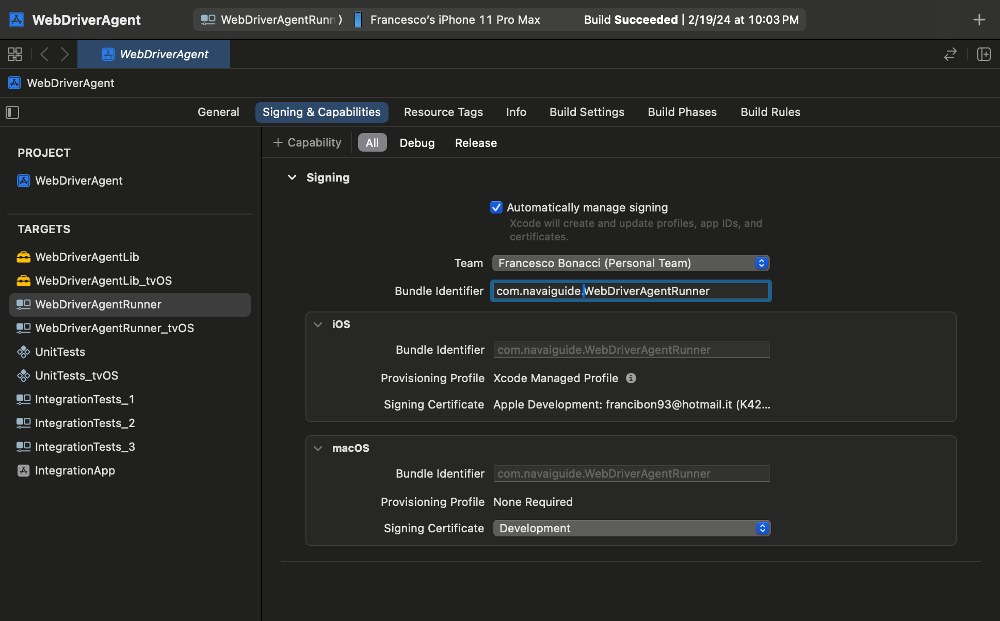

#  InterfaceAgent-iOS

Explore how to build iOS AI agents with InterfaceAgent-iOS.

## 💻 Getting Started

### Prerequisites

- Follow the core [pre-requisites](../core/README.md).
- macOS with Xcode 15.
- iOS device (simulators not supported).
- [Apple Developer](https://developer.apple.com/programs/) Free Account.
- Go Build Tools (currently required as a dependency for go-ios).
- Appium Server with XCUITest Driver.

### Steps

#### 1. ⚡️ Install InterfaceAgent-iOS

You can choose to either clone the repository or use npm, yarn, or pnpm to install InterfaceAgent.

#### npm:
```bash
npm install @InterfaceAgent/ios
```

#### Yarn:
```bash
yarn add @InterfaceAgent/ios
```

#### 2. Go-iOS Setup

Go-iOS is required for InterfaceAgent to list apps and start a pre-installed WDA Runner on the target device. If your device is running iOS 17, support for waking up the WDA Runner is experimental, and npm packages for go-ios are not available. Therefore, you need to install the latest version from the [ios-17 branch](https://github.com/danielpaulus/go-ios/tree/ios-17) and manually build an executable, which requires installing Go build tools.

```bash
# Install Go build tools on macOS
brew install go
```

Once installed, you can run this utility script to build go-ios. This will copy the go-ios executable to the `./packages/ios/bin` directory, which is necessary for the next steps.

```bash
# If you cloned the repository:
cd packages/ios
npx run build-go-ios

# If installed through the npm package:
npm explore @InterfaceAgent/ios -- npm run build-go-ios
```

#### 3. Appium

Install the Appium server globally:
```bash
npm install -g appium
```

Launching Appium from the terminal should result in a similar output:


Install and run `appium-doctor` to diagnose and fix any iOS configuration issues:
```bash
npm install -g appium-doctor
appium-doctor --ios
```

Install the [Appium XCUITest Driver](https://github.com/appium/appium-xcuitest-driver/tree/master):
```bash
appium driver install xcuitest
```

This step will also clone the Appium [WebDriverAgent (WDA)](https://appium.github.io/appium-xcuitest-driver/4.16/wda-custom-server) Xcode project, required in the next step. Check that the Xcode project exists at `~/.appium/node_modules/appium-xcuitest-driver/node_modules/appium-webdriveragent`.

#### 4. Enable Developer Settings & UI Automation

If you haven't already, enable [Developer Mode](https://developer.apple.com/documentation/xcode/enabling-developer-mode-on-a-device) on your target device. If required, reboot your phone.

Next, enable UI Automation from Settings/Developer. This will allow the WDA Runner to control your device and execute XCUITests.


#### 5. WDA Building and Signing

The next step is to build and sign the Appium WDA project through Xcode.

```bash
cd '~/.appium/node_modules/appium-xcuitest-driver/node_modules/appium-webdriveragent'
open 'WebDriverAgent.xcodeproj'
```



1. Select `WebDriverAgentRunner` from the target section.
2. Click on `Signing & Capabilities`.
3. Check the `Automatically manage signing` checkbox.
4. Choose your Team from the Team dropdown.
5. In `Bundle Identifier`, replace the value with a bundle identifier of your choice, for example: `com.<YOUR-ORG>.wda.runner`.

Building the WDA project from Xcode (and macOS) is optional if you already have a pre-built IPA, but it must be re-signed with your Apple Developer account's certificate. For instructions on how to do this, see Daniel Paulus' [wda-signer](https://github.com/danielpaulus/wda-signer).

Next, to deploy and run the WDA Runner on the target real device:

```bash
xcodebuild build-for-testing test-without-building -project WebDriverAgent.xcodeproj -scheme WebDriverAgentRunner -destination 'id=<YOUR_DEVICE_UDID>'
```

You can find your connected device UDID with go-ios.
```bash
./go-ios list
```

The `xcodebuild` step is only required once, as we will later use `go-ios` to wake up a previously installed WDA Runner on your device.

If the `xcodebuild` is successful, you should see a WDA Runner app installed, and your device will enter the UI Automation mode (indicated by a watermark on your screen).

#### 6. Wake Up WDA Runner & Run Appium Server

Next, let's exit UI Automation mode by holding the Volume Up and Down buttons simultaneously and ensure we can use go-ios to wake up the installation.

```bash
# If you cloned the repository:
npm run run-wda -- --WDA_BUNDLE_ID=com.example.wdabundleid --WDA_TEST_RUNNER_BUNDLE_ID=com.example.wdabundleid --DEVICE_UDID=12345

# If installed through the npm package:
npm explore @InterfaceAgent/ios -- npm run run-wda -- --WDA_BUNDLE_ID=com.example.wdabundleid --WDA_TEST_RUNNER_BUNDLE_ID=com.example.wdabundleid --DEVICE_UDID=12345
```

If successful, you should see the device entering UI Automation mode again. What's changed? Using go-ios, it will technically make it possible to control the device from Linux and, soon, Windows (see the latest go-ios release).

As we are not running XCUITests directly but through Appium, we will need to run the Appium Server next, which will listen for any WebDriverIO commands and translate them into XCUITests for the WDA Runner to execute.

```bash
# Provided that you've installed Appium as a global npm package
appium
```

#### 7. Run an iOS AI Agent
With the Appium Server and WDA running, we can finally run our first AI-powered iOS agent. Let's see how to:

```typescript
import { iInterfaceAgent } from "@InterfaceAgent/ios";

const iInterfaceAgent = new iInterfaceAgent({
    // openAIApiKey: "YOUR_OPEN_AI_API_KEY", // Optional if set through process.env.OPEN_AI_API_KEY
    appiumBaseUrl: 'http://127.0.0.1',
    appiumPort: 4723,
    iOSVersion: "17.3.0",
    deviceUdid: "00008030-00120DA4110A802E"
});

const fitnessPlannerQuery = "Help me run a 30-day fitness challenge.";
await iInterfaceAgent.runAsync({
    query: fitnessPlannerQuery
});
```

<p align="center">
  
</p>

## What's What?

**Go-iOS**: A set of tools written in Go that allows you to control iOS devices on Linux and Windows. It notably includes the capability to start and kill apps and run UI tests on iOS devices. It uses a reverse-engineered version of the DTX Message Framework.

**WebDriverAgent (WDA)**: To automate tasks on an iOS device, installing WebDriverAgent (WDA) is required. WDA, initially a Facebook project and now maintained by Appium, acts as the core for all iOS automation tools and services. Due to iOS's strict security, direct input simulations or screenshot captures via public APIs or shell commands are prevented. WebDriverAgent circumvents these limitations by launching an HTTP server on the device, turning XCUITest framework functions into accessible REST calls.

**UI Automation Mode**: This is the state triggered on the target device when running UI Automation XCUITests. It must be enabled through the Developer Settings before installing the WDA Runner App.

**WebdriverIO**: An open-source testing utility for Node.js that enables developers to automate testing for web applications. In the context of UI automation for iOS applications, WebdriverIO can be used alongside Appium, a mobile application automation framework. Appium acts as a bridge between WebdriverIO tests and the iOS platform, allowing tests written in WebdriverIO to interact with iOS applications as if a real user were using them. This integration supports the automation of both native and hybrid iOS apps.

**Appium**: An open-source, cross-platform test automation tool used for automating native, mobile web, and hybrid applications on iOS and Android platforms. Appium uses the WebDriver protocol to interact with iOS and Android applications. For iOS, it primarily relies on Apple's XCUITest framework (for iOS 9.3 and above), and for older versions, it used the UIAutomation framework. XCUITest, part of XCTest, is Apple's official UI testing framework, which Appium leverages to perform actions on the iOS UI.